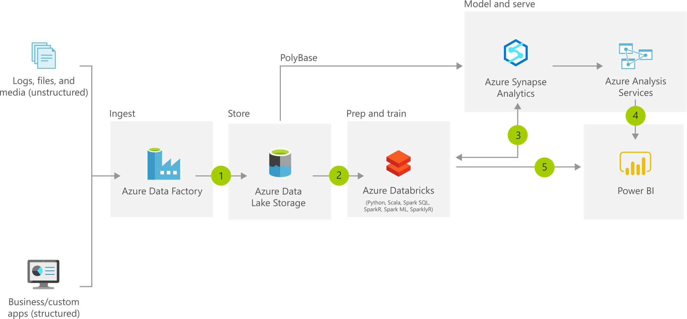

# Module 1 - Pipelines & Orchestration

## Sigma Data Academy 2021

---
# Inleiding

## Data van a naar b
Waar doen we het eigenlijk voor?

* Belastig op operationle systemen verminderen
* Snellere rapportages & dashboards

* Is dit batch of real-time?

### ETL vs ELT

* Extract
* Transform
* Load

Wat het verschil maakt is dat voor ETL het schema bekend moet zijn bij het laden van de data (*Schema on Write*). Bij ELT kan dat later, dit is ook wel bekend als (*Schema on Read*).

Over het algemeen praten noemen wel het werk nog steeds ETL waarbij dus vaak genoeg ELT toepassen. Het geeft echter aan dat we hier in een proces zitten van het verplaatsen en transformeren van data en in welke volgorde dat plaats vind is daarin minder belangrijk.

## Waarom ETL

Tegenwoordig kunnen we ook al een hoop data ophalen in Power BI. Waarom zouden we dit dat ook nog met data factory moeten doen?

> Waarom zouden we dit allemaal doen?

- Minimale belasting op bron (operationeel system)

ELT biedt het voordeel dat we bronnen minimaal **belasten** voor BI. Als we 5 BI reports hebben dat allemaal **dezelfde** bron onsluiten dan wordt dat voor een bron systeem extra belastend. Als de dan ook nog een een veelvoud aan gebruikers zijn dan wordt het voor het bron stysteem te belastend.

- Performance

Doordat we met ADF één keer de bron belasten en daarna zo klaar zetten voor front-end rapporates en dashboard, worden deze ook vele malen sneller.

- Organisatiebreed

Door businessrules op één plek uit te voeren hoeven we dat in de front-end niet meer toe te passen.

- Beheersbaarheid

Als een van de businessrules zou veranderen, dan is enkel in de ELT een aanpassing nodig. Dan hebben alle rapportages/dashboard daarna gelijk dezelfde businessrules. Zo hoe je niet elke report na te lopen of welke businessrules hier zijn toegepast en zo nodig moeten worden aangepast.

## ADF

- Wat is Azure Dafa Factory (ADF)

https://docs.microsoft.com/en-us/azure/data-factory/introduction

Microsoft heeft met Azure Data Factory Versie 2 (ADFv2) een stabiele dienst waarmee wij als Data Engineers data kunnnen verplaatsen en transformeren. Daarnaast biedt het ook de mogelijkheid om dit alles goed te coördineren -> Orchestration.

## ADF onderdelen

Als we naar de basisconcepten kijken voor ADF dan zie we de volgende onderdelen.

* Pipelines
* Activities
* Datasets
* Linked services
* Data Flows
* Integration Runtimes

in deze module komen ze bijna allemaal langs. Data flows worden in module 2 behandeld. 

---

## Azure Dafa Factory (ADF)

* Interface
  * > **URL**: https://adf.azure.com/

Demo laten zien hoe Azure data facotry er uit ziet!

* Documentatie
  * > **Docs**: https://docs.microsoft.com/en-us/azure/data-factory

> - Git_repository
> - *(ADF kan tegenwoordig de code opslaan in een git repository, daarvoor 
>   hebben we een repository nodig in Gibhub of Azure Devops. Maar er een aan 
   voor deze training.)*

---
## SQL configuratie

Set je zelf even als AD Admin voor je SQL Server. zo kun je makkelijke inloggen met management studio en hoe je niet de sa user te gebruiken.

Ook even firewall settings aanpassen. client ip toevoegenen Allow All Auzre Services.

---
### KeyVault Access policies
Voeg je eigen account (emailadres) even toe aan de access policies. Daarmee kun je de secrets uitlezen van keyvault.

--- 
## Setup Srouce control
Open je Azure data factory en gaan naar Manage.
Onder het kopje Sources control vind je Git configuratie. Klik op configure en configureer koppeling met de repository dat je hiervoor gemaakt hebt.

---
## Link Services
https://docs.microsoft.com/en-us/azure/data-factory/concepts-linked-services

Een Linked Services is als het waren je verbinding met een resources. Een aantal voorbeelde van resources: Bron systemen, KeyVault, Databases, webpages, api, datawarehouse. 

* Type verbinding
* Authentication
* Authorization 

We hebben een aadige keuze aan type verbindingen. voorbeeld zijn http, ftp, blob, sql, keyvault. Het is hierbij belangrijk om te weten of je ook toegang hebt om de betreffende verbinding op te kunnen zetten. Bij SQL Server gebruiken we in deze training bijvoorbeeld het SA Account, in de praktijk zul je een specifieke account gebruiken ter behoeven van ADF. Als je eenmaal verbinding kunt maken is het ook ban belang dat je ook daat werkelijk dat geen mag uitlezen wat nodig is voor je Data platform onsluiting.

Het aanmaken van dee linked services kan via het aanmaken van een data set. Dat is goed mogelijk, maar in een project zullen lindedservices vaak een vast structuur hebben en over omgevingen heen anders zijn. Daarom heeft het de voorkeur om de linked services eerst aan te maken en daarna de data sets.

---
### Setup Links Services
> **Opdracht**:  Maken van een Linked Services naar:
> * StorageAccount Containers stg & dwh
> * Key Vault
> * Azure SQL Database awlt & dwh

---
## Pipeline	
https://docs.microsoft.com/en-us/azure/data-factory/concepts-pipelines-activities

* Wat is een pipeline
Een pipeline is een logische groepering van activiteiten dat samen taak uitvoerd. Dit kan bij voorbeeld zijn het ophalen van data uit een bron systeem naar de staging area. of het vullen van een Dimentie table.

Activiteiten in een pipeline kunnne in de volgende drie groepen vallen.
data movement activities, data transformation activities and control activities.

Data moment kan een copy data activiteit hebben dat een simple kopie maakt van een een bron naar doel.

Data transformation kunnen het opschonen zijn van een data set. Hiervoor is wel processing powernodig dus deze acties zullen meer kosten mee brengen.

Control heeft je de mogelijkheid om volgoordelijkheid te bepalen, afhankelijkheden zichtbaar te maken en geeft je de mogelijkheid om een goed Orchestratie van je complete data flow.

Vanuit de interface kunnen van elke pipeline de onderliggende json ophalen. Deze json file wordt ook weg geschreven naar je git repository dat je eerder hebt gekoppeld. 

Een activiteit kan de volgende statussen hebben. 
- succeeded
- failed
- completed
- skipped

Voor elke status kan er een andere flow gestart worden. Zo kun je na een failed flow een flag setten dat de hele flow nu moet stoppen. Ook kan hier vanuit een bepaalde specifieke log melding weg geschreven worden.

* Parameters & Variables

> **Opdracht**: Maak een pipeline met een *wait* activiteit. Het aantal seconde wachten moet via een parameter worden gevuld.

---
## Data Set	
	* > **Docs**: https://docs.microsoft.com/en-us/azure/data-factory/concepts-datasets-linked-services

* Wat is en een data set
Een dataset is een benomende view dat verwijsed of refereerd naar de data wat gebruikt kan worden als input of output van een activiteit.

* Kolommen & Data types
Met een dataset definieer je ook wat voor bestandstype het betreft. Ook kan er al op dit moment een Definitie gemaakt wordt hoe een data set uit ziet. Welke namen hebben columns en welke data type betrefd het. Dit is echter geen verplichting dit kan namelijk ook later in een data flow worden opgelost.

* Maken van een Data set
[sql_AWLT_Customer] op basis van de tabel customer uit de database AWLT

* Parameters
---
## Opdrachten
> Bron > Datalake (CopyDate)	
---

## Integration runtime	
*	Waar draait het dan
	* Best effort voor Locatie
* Drie spaken
	* Azure
	* Self-hosted
	* Azure-SSIS

https://docs.microsoft.com/en-us/azure/data-factory/concepts-integration-runtime

---
## Execution & Triggers
* Onces
* Schedule trigger
* Tumbling window trigger
* Event-based trigger

> **Docs**: https://docs.microsoft.com/en-us/azure/data-factory/concepts-pipeline-execution-triggers
---
## Monitoring/ Logging	

---
## Recap Module 1
* Wat is er allemaal besproken.
* Zijn er nog vragen?
---

